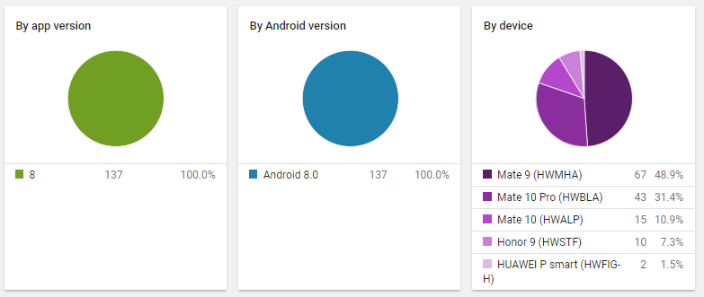
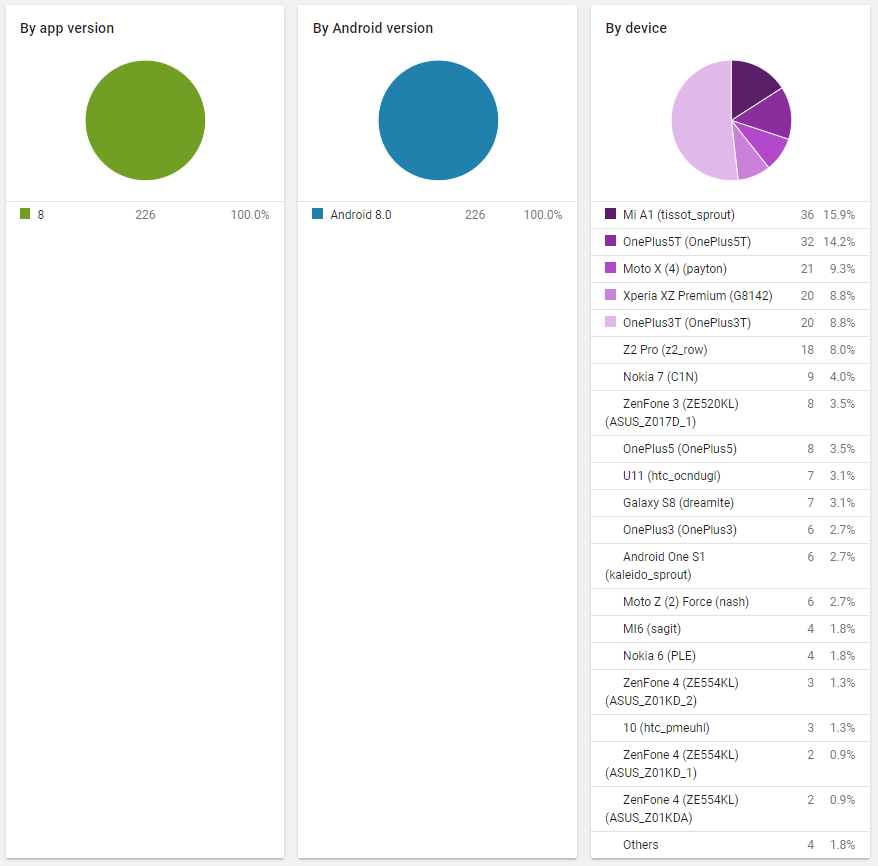

# Android 8.0 上一个奇怪的IllegalStateException

## 前言

**API 26之后，给Activity应用Dialog主题，大部分第三方ROM都存在巨坑。**

## 起因

公司项目在适配Android 8.0之后，爆发了一个触发率极高，而在Google Play Console上又找不到任何有效错误信息的IllegalStateException。Google Play Console统计信息如下：
```
java.lang.RuntimeException:
  at android.app.ActivityThread.performLaunchActivity (ActivityThread.java:3184)
  at android.app.ActivityThread.handleLaunchActivity (ActivityThread.java:3279)
  at android.app.ActivityThread.-wrap12 (Unknown Source)
  at android.app.ActivityThread$H.handleMessage (ActivityThread.java:1881)
  at android.os.Handler.dispatchMessage (Handler.java:108)
  at android.os.Looper.loop (Looper.java:166)
  at android.app.ActivityThread.main (ActivityThread.java:7406)
  at java.lang.reflect.Method.invoke (Method.java)
  at com.android.internal.os.Zygote$MethodAndArgsCaller.run (Zygote.java:245)
  at com.android.internal.os.ZygoteInit.main (ZygoteInit.java:926)
Caused by: java.lang.IllegalStateException:
  at android.app.Activity.onCreate (Activity.java:1076)
  at android.support.v4.app.SupportActivity.onCreate (SupportActivity.java)
  at android.support.v4.app.FragmentActivity.onCreate (FragmentActivity.java:15)
  at android.support.v7.app.AppCompatActivity.onCreate (AppCompatActivity.java:36)
  at android.app.Activity.performCreate (Activity.java:7365)
  at android.app.Instrumentation.callActivityOnCreate (Instrumentation.java:1218)
  at android.app.ActivityThread.performLaunchActivity (ActivityThread.java:3137)
  at android.app.ActivityThread.handleLaunchActivity (ActivityThread.java:3279)
  at android.app.ActivityThread.-wrap12 (Unknown Source)
  at android.app.ActivityThread$H.handleMessage (ActivityThread.java:1881)
  at android.os.Handler.dispatchMessage (Handler.java:108)
  at android.os.Looper.loop (Looper.java:166)
  at android.app.ActivityThread.main (ActivityThread.java:7406)
  at java.lang.reflect.Method.invoke (Method.java)
  at com.android.internal.os.Zygote$MethodAndArgsCaller.run (Zygote.java:245)
  at com.android.internal.os.ZygoteInit.main (ZygoteInit.java:926)
```
以及统计到的另一个错误信息：
```
java.lang.RuntimeException:
  at android.app.ActivityThread.performLaunchActivity (ActivityThread.java:2946)
  at android.app.ActivityThread.handleLaunchActivity (ActivityThread.java:3046)
  at android.app.ActivityThread.-wrap11 (Unknown Source)
  at android.app.ActivityThread$H.handleMessage (ActivityThread.java:1688)
  at android.os.Handler.dispatchMessage (Handler.java:105)
  at android.os.Looper.loop (Looper.java:164)
  at android.app.ActivityThread.main (ActivityThread.java:6809)
  at java.lang.reflect.Method.invoke (Method.java)
  at com.android.internal.os.Zygote$MethodAndArgsCaller.run (Zygote.java:240)
  at com.android.internal.os.ZygoteInit.main (ZygoteInit.java:767)
Caused by: java.lang.IllegalStateException:
  at android.app.Activity.onCreate (Activity.java:995)
  at android.support.v4.app.SupportActivity.onCreate (SupportActivity.java)
  at android.support.v4.app.FragmentActivity.onCreate (FragmentActivity.java:15)
  at android.support.v7.app.AppCompatActivity.onCreate (AppCompatActivity.java:36)
  at android.app.Activity.performCreate (Activity.java:6998)
  at android.app.Instrumentation.callActivityOnCreate (Instrumentation.java:1230)
  at android.app.ActivityThread.performLaunchActivity (ActivityThread.java:2899)
  at android.app.ActivityThread.handleLaunchActivity (ActivityThread.java:3046)
  at android.app.ActivityThread.-wrap11 (Unknown Source)
  at android.app.ActivityThread$H.handleMessage (ActivityThread.java:1688)
  at android.os.Handler.dispatchMessage (Handler.java:105)
  at android.os.Looper.loop (Looper.java:164)
  at android.app.ActivityThread.main (ActivityThread.java:6809)
  at java.lang.reflect.Method.invoke (Method.java)
  at com.android.internal.os.Zygote$MethodAndArgsCaller.run (Zygote.java:240)
  at com.android.internal.os.ZygoteInit.main (ZygoteInit.java:767)
```
两份错误信息并无太大区别，但就从错误信息来看，触发该Bug的必然是项目中的Activity，而该Activity在执行其父类的代码时就已经崩溃，而自身的代码并没有执行。这找起来就棘手了，都不清楚是哪个页面引发的。于是再结合错误信息截图来看看：





错误仅仅发生在适配API 26的版本上，错误仅仅发生在API 26的ROM，而手头的两台设备，Nexus 5X 跟Pixel 2 XL都未触发，而Google Play Console上也没有统计到亲儿子存在该问题，出问题的基本上都是国内的ROM，尤其华为的居多。

现在所知的关键点是，targetSdkVersion在26及以上且系统API在26及以上的设备才会触发，而触发的Activity连自身的代码都没有执行。那么就只剩Activity的声明处了，先去8.0行为变更里面看了一遍，并没有对Activity声明增加新的要求。翻开AndroidManifest.xml文件，所有的Activity都检查一遍，也并没有不和谐之处，无非是设置一下label以及配置一下theme。这些信息都不足以查出触发点来时，就只能找一台可以触发的机器了，于是通过测试的同事找来一台在触发机器列表里的手机，然而系统与应用及设备均符合触发条件，可这台机器就是不触发，实在无解。

眼见着就要无从下手了，但忽然想到公司项目还接入了友盟统计，抱着侥幸的心理上去看看是否有什么蛛丝马迹。不常使用友盟查看崩溃统计主要是其C++层的报错完全统计不到（项目涉及NDK开发）而数据又不够直观。幸运的是友盟果然统计到了重要信息，除开上面的报错信息以外，其补上了Google Play Console漏掉的一部分，而这一部分非常关键：
```
java.lang.IllegalStateException: Only fullscreen opaque activities can request orientation
  at android.app.Activity.onCreate (Activity.java:1076)
  at android.support.v4.app.SupportActivity.onCreate (SupportActivity.java)
  at android.support.v4.app.FragmentActivity.onCreate (FragmentActivity.java:15)
  at android.support.v7.app.AppCompatActivity.onCreate (AppCompatActivity.java:36)
  at android.app.Activity.performCreate (Activity.java:7365)
  at android.app.Instrumentation.callActivityOnCreate (Instrumentation.java:1218)
  at android.app.ActivityThread.performLaunchActivity (ActivityThread.java:3137)
  at android.app.ActivityThread.handleLaunchActivity (ActivityThread.java:3279)
  at android.app.ActivityThread.-wrap12 (Unknown Source)
  at android.app.ActivityThread$H.handleMessage (ActivityThread.java:1881)
  at android.os.Handler.dispatchMessage (Handler.java:108)
  at android.os.Looper.loop (Looper.java:166)
  at android.app.ActivityThread.main (ActivityThread.java:7406)
  at java.lang.reflect.Method.invoke (Method.java)
  at com.android.internal.os.Zygote$MethodAndArgsCaller.run (Zygote.java:245)
  at com.android.internal.os.ZygoteInit.main (ZygoteInit.java:926)
```
## 问题
其实仅仅这一句话最关键：

***Only fullscreen opaque activities can request orientation***

只有全屏不透明的Activity可以请求方向

没错，项目里的部分Activity应用了Dialog的主题，也就是说它是非全屏且透明的Activity。然而奇怪的是，这些Dialog样式的Activity并没有设定screenOrientation属性，也就是该属性用的是默认值，于该Activity来说并没有request orientation，因此，此处个人判定，应该是第三方ROM的问题。对于Dialog样式的Activity，即便是设置了screenOrientation属性，也不应该Activity崩溃，而应该是设置的screenOrientation属性无效，更何况并没有设置screenOrientation属性，仅仅是对Activity应用了Dialog的主题。

## 解决
定义一个透明的Activity主题：增加android:windowIsTranslucent属性为true，并设置透明的背景。而对于非要使用对话框样式的Activity，那么就对照对话框的Theme进行设置了，此处不展开说了。