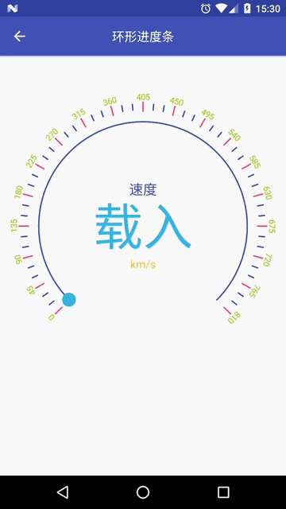
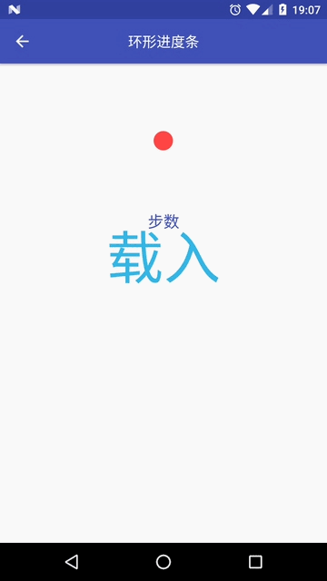

CircleProgressBar
=================


环形进度条

介绍
---

带载入动画的环形进度条，可高度配置，支持配置成表盘。

**属性说明**

xml布局属性|属性值|对应方法|说明
---|---|---|---
cpbGravity|给定值及组合|setGravity(int gravity)|设置排版方式，当高宽超过绘制所需尺寸时，此属性定义其绘制位置
cpbRadius|dimension|setRadius(float radius)|设置环形半径，其包括了绘制的进度的尺寸
cpbStartAngle|integer|setStartAngle(int angle)|设置起始角度
cpbSweepAngle|integer|setSweepAngle(int angle)|设置扫描角度
cpbBackgroundSize|dimension|setBackgroundSize(float size)|设置背景尺寸
cpbBackgroundColor|color|setBackgroundColor(int color)|设置背景颜色
cpbProgressSize|dimension|setProgressSize(float size)|设置环形尺寸
cpbMax|integer|setMax(int max)|设置最大值
cpbProgress|integer|setProgress(int progress)|设置进度
cpbFirstGradientColors|color|setGradientColors(int... colors)|设置渐变色
cpbSecondGradientColors|color|setGradientColors(int... colors)|设置渐变色
cpbThirdGradientColors|color|setGradientColors(int... colors)|设置渐变色
cpbFourthGradientColors|color|setGradientColors(int... colors)|设置渐变色
cpbFirstGradientPositions|float|setGradientPositions(float... positions)|设置渐变点
cpbSecondGradientPositions|float|setGradientPositions(float... positions)|设置渐变点
cpbThirdGradientPositions|float|setGradientPositions(float... positions)|设置渐变点
cpbFourthGradientPositions|float|setGradientPositions(float... positions)|设置渐变点
cpbDialVisibility|visible、invisible、gone|setDialVisibility(int visibility)|设置刻度表盘是否显示
cpbDialGap|dimension|setDialGap(float gap)|设置刻度间隔
cpbDialAngle|integer|setDialAngle(int angle)|设置刻度角度
cpbDialHeight|dimension|setDialHeight(float height)|设置刻度高
cpbDialWidth|dimension|setDialWidth(float width)|设置刻度宽
cpbDialColor|color|setDialColor(int color)|设置刻度颜色
cpbDialSpecialUnit|integer|setDialSpecialUnit(int unit)|设置特殊刻度之间间隔，单位以普通刻度为参考，设置为2时，第1个普通刻度、第3个普通刻度等每隔一个普通刻度都变为特殊刻度
cpbDialSpecialHeight|dimension|setDialSpecialHeight(float height)|设置特殊刻度的高
cpbDialSpecialWidth|dimension|setDialSpecialWidth(float width)|设置特殊刻度的宽
cpbDialSpecialColor|color|setDialSpecialColor(int color)|设置特殊刻度颜色
cpbDialGravity|Center、Top、Bottom|setDialGravity(int gravity)|设置长短刻度的对齐方式
cpbShowSpecialDialValue|boolean|setShowSpecialDialValue(boolean show)|设置是否显示特殊刻度值
cpbSpecialDialValueGap|dimension|setSpecialDialValueGap(float gap)|设置特殊刻度值间距
cpbSpecialDialValueTextSize|dimension|setSpecialDialValueTextSize(float textSize)|设置特殊刻度值文字大小
cpbSpecialDialValueTextColor|color|setSpecialDialValueTextColor(int color)|设置特殊刻度值文字颜色
cpbShowProgressValue|boolean|setShowProgressValue(boolean show)|设置是否显示进度值
cpbProgressValueTextSize|dimension|setProgressValueTextSize(float textSize)|设置进度值文字
cpbProgressValueTextColor|color|setProgressValueTextColor(int color)|设置进度值文字颜色
cpbTopText|string|setTopText(String text)|设置进度值顶部文字
cpbTopTextGap|dimension|setTopTextGap(float gap)|设置进度值顶部文字间隔
cpbTopTextSize|dimension|setTopTextSize(float textSize)|设置进度值顶部文字大小
cpbTopTextColor|color|setTopTextColor(int color)|设置进度值顶部文字颜色
cpbBottomText|string|setBottomText(String text)|设置进度值底部文字
cpbBottomTextGap|dimension|setBottomTextGap(float gap)|设置进度值底部文字间隔
cpbBottomTextSize|dimension|setBottomTextSize(float textSize)|设置进度值底部文字大小
cpbBottomTextColor|color|setBottomTextColor(int color)|设置进度值底部文字颜色
cpbScaleType|给定值及组合|setScaleType(int scaleType)|设置缩放类型
cpbProgressDuration|integer|setProgressDuration(long duration)|设置进度动画时长，下次动画才有效
cpbProgressMode|Progress、Loading|setProgressMode(ProgressMode mode)|设置进度模式
cpbLoadingStartAngle|integer|setLoadingStartAngle(int angle)|设置载入起始角度
cpbLoadingSweepAngle|integer|setLoadingSweepAngle(int angle)|设置载入扫描角度
cpbLoadingDuration|integer|setLoadingDuration(long duration)|设置载入动画循环时长
cpbLoadingRepeatMode|Restart、Reverse|setLoadingRepeatMode(int mode)|设置载入动画循环模式
cpbLoadingDrawOther|boolean|setLoadingDrawOther(boolean draw)|载入模式下是否绘制其他元素
cpbLoadingText|string|setLoadingText(String text)|设置载入时进度文字

截图
---



先决条件
----

minSdkVersion 11

入门
---

**引用:**

```
dependencies {
    ...
    implementation 'am.widget:circleprogressbar:1.0.3'
    ...
}
```

**布局:**

```xml
<am.widget.circleprogressbar.CircleProgressBar
    android:layout_width="match_parent"
    android:layout_height="480dp"
    app:cpbGravity="center"
    app:cpbRadius="160dp"
    app:cpbStartAngle="135"
    app:cpbSweepAngle="270"
    app:cpbBackgroundSize="2dp"
    app:cpbBackgroundColor="@color/colorPrimary"
    app:cpbProgressSize="20dp"
    app:cpbMax="810"
    app:cpbProgress="315"
    app:cpbFirstGradientColors="#ff33b5e5"
    app:cpbSecondGradientColors="#ff99cc00"
    app:cpbThirdGradientColors="#ffffbb33"
    app:cpbFourthGradientColors="#ffff4444"
    app:cpbDialGap="4dp"
    app:cpbDialAngle="5"
    app:cpbDialHeight="10dp"
    app:cpbDialWidth="2dp"
    app:cpbDialColor="@color/colorPrimary"
    app:cpbDialSpecialUnit="3"
    app:cpbDialSpecialHeight="15dp"
    app:cpbDialSpecialColor="@color/colorAccent"
    app:cpbShowSpecialDialValue="true"
    app:cpbSpecialDialValueGap="2dp"
    app:cpbSpecialDialValueTextSize="12sp"
    app:cpbSpecialDialValueTextColor="#ff99cc00"
    app:cpbShowProgressValue="true"
    app:cpbProgressValueTextSize="72sp"
    app:cpbProgressValueTextColor="#ff33b5e5"
    app:cpbTopText="速度"
    app:cpbTopTextSize="20sp"
    app:cpbTopTextGap="10dp"
    app:cpbTopTextColor="@color/colorPrimary"
    app:cpbBottomText="km/s"
    app:cpbBottomTextSize="16sp"
    app:cpbBottomTextGap="15dp"
    app:cpbBottomTextColor="#ffffbb33"
    app:cpbScaleType="None"
    app:cpbProgressDuration="2000"
    app:cpbProgressMode="Loading"
    app:cpbLoadingDuration="3000"
    app:cpbLoadingRepeatMode="Reverse"
    app:cpbLoadingDrawOther="true"
    app:cpbLoadingText="载入"/>
```

**代码：**

```
CircleProgressBar cpbDemo = (CircleProgressBar) findViewById(R.id.circleprogressbar_cpb_demo);
cpbDemo.setStartAngle(-90);
cpbDemo.setSweepAngle(360);
cpbDemo.setGradientColors(0xffff4444);
cpbDemo.setBackgroundSize(0);
cpbDemo.setProgress(520);
cpbDemo.setProgressSize(64);
cpbDemo.setDialVisibility(View.GONE);
cpbDemo.setProgressMode(CircleProgressBar.ProgressMode.PROGRESS);
cpbDemo.setShowProgressValue(true);
cpbDemo.setTopText("步数");
cpbDemo.setBottomText(null);
```

支持
---

- Google+: https://plus.google.com/114728839435421501183
- Gmail: moferalex@gmail.com

如果发现错误，请在此处提出:
https://github.com/AlexMofer/ProjectX/issues

许可
---

Copyright (C) 2015 AlexMofer

Licensed to the Apache Software Foundation (ASF) under one or more contributor
license agreements.  See the NOTICE file distributed with this work for
additional information regarding copyright ownership.  The ASF licenses this
file to you under the Apache License, Version 2.0 (the "License"); you may not
use this file except in compliance with the License.  You may obtain a copy of
the License at

http://www.apache.org/licenses/LICENSE-2.0

Unless required by applicable law or agreed to in writing, software
distributed under the License is distributed on an "AS IS" BASIS, WITHOUT
WARRANTIES OR CONDITIONS OF ANY KIND, either express or implied.  See the
License for the specific language governing permissions and limitations under
the License.