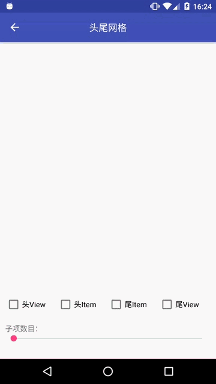

HeaderFooterGridView
====================


头尾GridView

介绍
---

支持AUTO_FIT模式，头尾模式有两种，无反射代码。

截图
---



先决条件
----

minSdkVersion 4

入门
---

**引用:**

```
dependencies {
    ...
    implementation 'am.widget:headerfootergridview:1.0.1'
    ...
}
```

**布局:**

```xml
<am.widget.headerfootergridview.HeaderFooterGridView
    android:id="@+id/gird_hfg_content"
    android:layout_width="match_parent"
    android:layout_height="match_parent"
    android:columnWidth="64dp"
    android:gravity="center"
    android:horizontalSpacing="10dip"
    android:numColumns="auto_fit"
    android:stretchMode="columnWidth"
    android:verticalSpacing="10dip" />
```

**代码：**

```
HeaderFooterGridView hfgContent = (HeaderFooterGridView) findViewById(id);
hfgContent.addHeaderView(headerView);
hfgContent.removeHeaderView(headerView);
hfgContent.addHeaderItem(headerItem);
hfgContent.removeHeaderItem(headerItem);
hfgContent.addHeaderItem(headerItem, null, true);
hfgContent.addFooterItem(footerItem);
hfgContent.removeFooterItem(footerItem);
hfgContent.addFooterItem(footerItem, null, true);
hfgContent.addFooterView(footerView);
hfgContent.removeFooterView(footerView);
```

注意
---

- 空白站位View占用GridView的子项position，处理position时需要小心

支持
---

- Google+: https://plus.google.com/114728839435421501183
- Gmail: moferalex@gmail.com

如果发现错误，请在此处提出:
https://github.com/AlexMofer/ProjectX/issues

许可
---

Copyright (C) 2015 AlexMofer

Licensed to the Apache Software Foundation (ASF) under one or more contributor
license agreements.  See the NOTICE file distributed with this work for
additional information regarding copyright ownership.  The ASF licenses this
file to you under the Apache License, Version 2.0 (the "License"); you may not
use this file except in compliance with the License.  You may obtain a copy of
the License at

http://www.apache.org/licenses/LICENSE-2.0

Unless required by applicable law or agreed to in writing, software
distributed under the License is distributed on an "AS IS" BASIS, WITHOUT
WARRANTIES OR CONDITIONS OF ANY KIND, either express or implied.  See the
License for the specific language governing permissions and limitations under
the License.