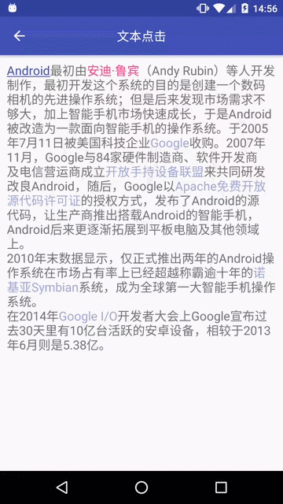

MultiActionTextView
===================


文字可点击TextView

介绍
---

设置文字部分可点击，点击执行不同操作。

截图
---



先决条件
----

无

入门
---

**引用:**

```
dependencies {
    ...
    implementation 'am.widget:multiactiontextview:1.0.3'
    ...
}
```

**布局:**

```xml
<am.widget.multiactiontextview.MultiActionTextView
    android:layout_width="match_parent"
    android:layout_height="wrap_content" />
```

**代码：**

```
MultiActionTextView textView = (MultiActionTextView) findViewById(id);
MultiActionClickableSpan action1 = new MultiActionClickableSpan(0, 7, colorPrimary, true, false, listener);
MultiActionClickableSpan action2 = new MultiActionClickableSpan(10, 15, colorAccent, false, true, listener);
MultiActionClickableSpan action3 = new MultiActionClickableSpan(134, 140, colorRipple, false, true, listener);
textView.setText(text, action1, action2, action3);
```

注意
---

- MultiActionClickableSpan可设置是否拦截View的OnClickListener响应
- MultiActionClickableSpan可以设置不同的颜色
- MultiActionTextView会一直假装自己获取着焦点

支持
---

- Google+: https://plus.google.com/114728839435421501183
- Gmail: moferalex@gmail.com

如果发现错误，请在此处提出:
https://github.com/AlexMofer/ProjectX/issues

许可
---

Copyright (C) 2015 AlexMofer

Licensed to the Apache Software Foundation (ASF) under one or more contributor
license agreements.  See the NOTICE file distributed with this work for
additional information regarding copyright ownership.  The ASF licenses this
file to you under the Apache License, Version 2.0 (the "License"); you may not
use this file except in compliance with the License.  You may obtain a copy of
the License at

http://www.apache.org/licenses/LICENSE-2.0

Unless required by applicable law or agreed to in writing, software
distributed under the License is distributed on an "AS IS" BASIS, WITHOUT
WARRANTIES OR CONDITIONS OF ANY KIND, either express or implied.  See the
License for the specific language governing permissions and limitations under
the License.