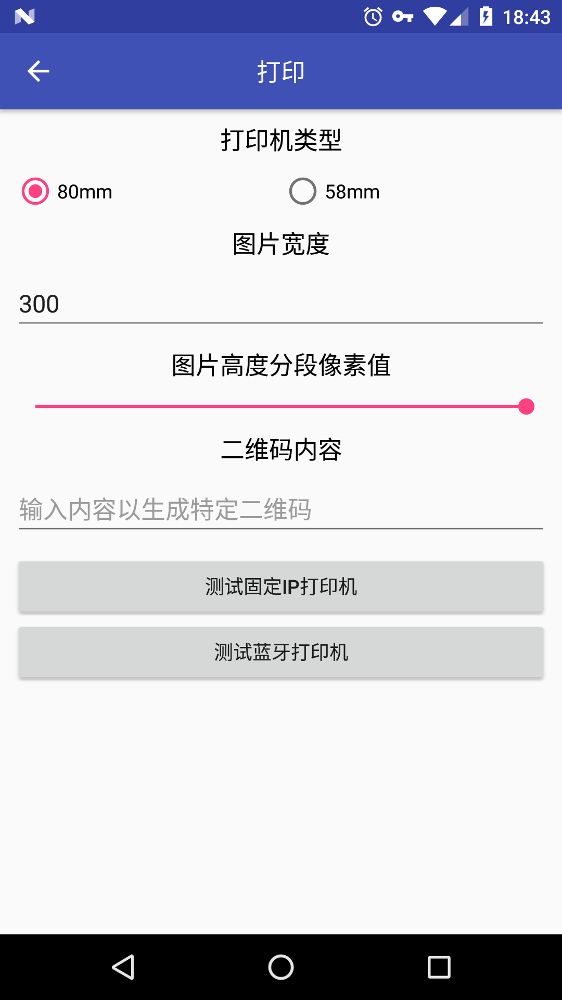
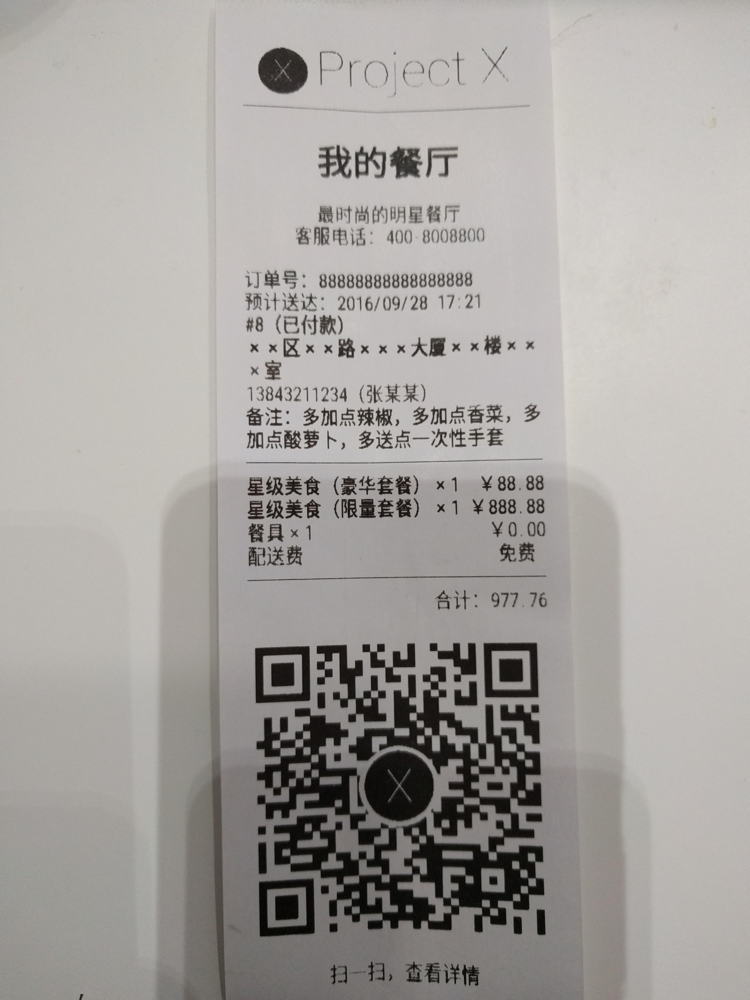

Printer
=======


ES-POS命令打印辅助库

介绍
---

标准ESC-POS命令打印，固定IP或蓝牙打印，支持黑白图片打印。
其中PrintCommands类列出了基本所有的ESC-POS打印命令。
打印指令参考自Commande ESCPOS.pdf文档。

截图
---



先决条件
----

- minSdkVersion 5
- ```<uses-permission android:name="android.permission.INTERNET" />```
- ```<uses-permission android:name="android.permission.BLUETOOTH" />```

入门
---

**引用:**

```java
dependencies {
    ...
    implementation 'am.util:printer:2.1.0'
    ...
}
```

**添加权限:**

添加蓝牙权限```<uses-permission android:name="android.permission.BLUETOOTH" />```或者网络请求权限```<uses-permission android:name="android.permission.INTERNET" />```

**实现接口:**

实现PrintDataMaker接口，完成具体打印任务：

```java
public class TestPrintDataMaker implements PrintDataMaker {

    private Context context;
    private String qr;
    private int width;
    private int height;

    public TestPrintDataMaker(Context context, String qr, int width, int height) {
        this.context = context;
        this.qr = qr;
        this.width = width;
        this.height = height;
    }

    @Override
    public List<byte[]> getPrintData(int type) {
        ArrayList<byte[]> data = new ArrayList<>();
        try {
            PrinterWriter printer;
            printer = type == PrinterWriter58mm.TYPE_58 ? new PrinterWriter58mm(height, width) : new PrinterWriter80mm(height, width);
            printer.setAlignCenter();
            data.add(printer.getDataAndReset());

            ArrayList<byte[]> image1 = printer.getImageByte(context.getResources(), R.drawable.ic_printer_logo);
            data.addAll(image1);

            printer.setAlignLeft();
            printer.printLine();
            printer.printLineFeed();

            printer.printLineFeed();
            printer.setAlignCenter();
            printer.setEmphasizedOn();
            printer.setFontSize(1);
            printer.print("我的餐厅");
            printer.printLineFeed();
            printer.setFontSize(0);
            printer.setEmphasizedOff();
            printer.printLineFeed();

            printer.print("最时尚的明星餐厅");
            printer.printLineFeed();
            printer.print("客服电话：400-8008800");
            printer.printLineFeed();

            printer.setAlignLeft();
            printer.printLineFeed();

            printer.print("订单号：88888888888888888");
            printer.printLineFeed();

            printer.print("预计送达：" +
                    new SimpleDateFormat("yyyy/MM/dd HH:mm", Locale.getDefault())
                            .format(new Date(System.currentTimeMillis())));
            printer.printLineFeed();

            printer.setEmphasizedOn();
            printer.print("#8（已付款）");
            printer.printLineFeed();
            printer.print("××区××路×××大厦××楼×××室");
            printer.printLineFeed();
            printer.setEmphasizedOff();
            printer.print("13843211234");
            printer.print("（张某某）");
            printer.printLineFeed();
            printer.print("备注：多加点辣椒，多加点香菜，多加点酸萝卜，多送点一次性手套");
            printer.printLineFeed();

            printer.printLine();
            printer.printLineFeed();

            printer.printInOneLine("星级美食（豪华套餐）×1", "￥88.88", 0);
            printer.printLineFeed();
            printer.printInOneLine("星级美食（限量套餐）×1", "￥888.88", 0);
            printer.printLineFeed();
            printer.printInOneLine("餐具×1", "￥0.00", 0);
            printer.printLineFeed();
            printer.printInOneLine("配送费", "免费", 0);
            printer.printLineFeed();

            printer.printLine();
            printer.printLineFeed();

            printer.setAlignRight();
            printer.print("合计：977.76");
            printer.printLineFeed();
            printer.printLineFeed();

            printer.setAlignCenter();

            data.add(printer.getDataAndReset());

            String bitmapPath = FileUtils.getExternalFilesDir(context, "Temp") + "tmp_qr.jpg";
            if (QRCodeUtil.createQRImage(qr, 380, 380, null, bitmapPath)) {
                ArrayList<byte[]> image2 = printer.getImageByte(bitmapPath);
                data.addAll(image2);
            } else {
                ArrayList<byte[]> image2 = printer
                        .getImageByte(context.getResources(), R.drawable.ic_printer_qr);
                data.addAll(image2);
            }

            printer.printLineFeed();
            printer.print("扫一扫，查看详情");
            printer.printLineFeed();
            printer.printLineFeed();
            printer.printLineFeed();
            printer.printLineFeed();
            printer.printLineFeed();

            printer.feedPaperCutPartial();

            data.add(printer.getDataAndClose());
            return data;
        } catch (Exception e) {
            return new ArrayList<>();
        }
    }
}
```

**准备打印:**

创建打印执行者：

```java
PrintExecutor executor = new PrintExecutor(String ip, int port, int type);
PrintExecutor executor = new PrintExecutor(BluetoothDevice device, int type);
```

设置执行者状态监听（非必须）：

```java
executor.setOnStateChangedListener(new PrintSocketHolder.OnStateChangedListener() {
    @Override
    public void onStateChanged(int state) {
        switch (state) {
            case PrintSocketHolder.STATE_0:
                //生成打印页面数据...
                break;
            case PrintSocketHolder.STATE_1:
                //生成数据成功，开始创建Socket连接...
                break;
            case PrintSocketHolder.STATE_2:
                //创建Socket成功，开始获取输出流...
                break;
            case PrintSocketHolder.STATE_3:
                //获取输出流成功，开始写入打印页面数据...
                break;
            case PrintSocketHolder.STATE_4:
                //写入打印页面数据成功，正在完成打印...
                break;
        }
    }
});
```

设置执行者回调监听（非必须）：

```java
executor.setOnPrintResultListener(new PrintExecutor.OnPrintResultListener() {
    @Override
    public void onResult(int errorCode) {
        switch (errorCode) {
            case PrintSocketHolder.ERROR_0:
                //打印成功完成！
                break;
            case PrintSocketHolder.ERROR_1:
                //生成打印页面数据失败！
                break;
            case PrintSocketHolder.ERROR_2:
                //创建Socket失败！
                break;
            case PrintSocketHolder.ERROR_3:
                //获取输出流失败！
                break;
            case PrintSocketHolder.ERROR_4:
                //写入打印页面数据失败！
                break;
            case PrintSocketHolder.ERROR_5:
                //必要的参数不能为空！
                break;
            case PrintSocketHolder.ERROR_6:
                //关闭Socket出错
                break;
            case PrintSocketHolder.ERROR_100:
                //打印失败
                break;
        }
    }
});
```

**执行打印:**

```java
int result = executor.doPrinterRequest(PrintDataMaker maker);//同步
executor.doPrinterRequestAsync(PrintDataMaker maker);//异步
```

**自定义**

如果你要实现自己的打印机PrinterWriter，那么你需要继承PrinterWriter，并实现其
必须的方法。示例:

```java
public class PrinterWriter80mm extends PrinterWriter {

    public static final int TYPE_80 = 80;// 纸宽80mm
    public int width = 500;

    public PrinterWriter80mm() throws IOException {
    }

    public PrinterWriter80mm(int parting) throws IOException {
        super(parting);
    }

    public PrinterWriter80mm(int parting, int width) throws IOException {
        super(parting);
        this.width = width;
    }

    @Override
    protected int getLineWidth() {
        //一行能够放下多少个“-”
        return 24;
    }

    @Override
    protected int getLineStringWidth(int textSize) {
        //根据字体的大小，一行可以放下多少个英文字符
        switch (textSize) {
            default:
            case 0:
                return 47;
            case 1:
                return 23;
        }
    }

    @Override
    protected int getDrawableMaxWidth() {
        //图片能够全部打印在纸上的最大宽度
        return width;
    }
}
```

注意
---

- 打印图片出现乱码或者打印不出，大部分原因是打印机缓存较小导致，可调小PrinterWriter80mm的parting参数，设置其图片高度分割值（0～255），调小了还不行的话，缩小图片尺寸或者调整输出流的写入方式。
- 仅提供建立蓝牙连接打印，不包括蓝牙搜索及配对功能
- 不包含二维码生成功能
- PrintCommands包含了大量打印指令，但是并非全部经过测试，而且并非所有打印机都支持。

支持
---

- Google+: https://plus.google.com/114728839435421501183
- Gmail: moferalex@gmail.com

如果发现错误，请在此处提出:
https://github.com/AlexMofer/ProjectX/issues

许可
---

Copyright (C) 2015 AlexMofer

Licensed to the Apache Software Foundation (ASF) under one or more contributor
license agreements.  See the NOTICE file distributed with this work for
additional information regarding copyright ownership.  The ASF licenses this
file to you under the Apache License, Version 2.0 (the "License"); you may not
use this file except in compliance with the License.  You may obtain a copy of
the License at

http://www.apache.org/licenses/LICENSE-2.0

Unless required by applicable law or agreed to in writing, software
distributed under the License is distributed on an "AS IS" BASIS, WITHOUT
WARRANTIES OR CONDITIONS OF ANY KIND, either express or implied.  See the
License for the specific language governing permissions and limitations under
the License.