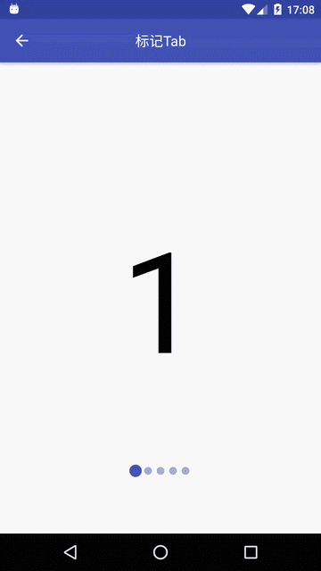

TagTabStrip
===========


标志小点

介绍
---

继承自BaseTabStrip，实现ViewPager标志小点，一般用于功能引导页面及新功能简介页，
为ViewPager添加标志小点，并不仅限于小点，标志由设置的Drawable决定，
普通模式为双Drawable交替模式，亦可设置为单Drawable缩放模式。

截图
---



先决条件
----

- minSdkVersion 14
- 保持跟其他官方支持库版本一致（如：com.android.support:appcompat-v7）

入门
---

**引用:**

```java
dependencies {
    ...
    compile 'am.widget:tagtabstrip:26.1.0'
    ...
}
```

**布局:**

```xml
<am.widget.tagtabstrip.TagTabStrip
    xmlns:app="http://schemas.android.com/apk/res-auto"
    android:layout_width="wrap_content"
    android:layout_height="wrap_content"
    android:drawablePadding="6dp"
    android:gravity="center"
    app:ttsScale="1.6"
    app:ttsDrawable="@drawable/ic_tag"/>
```

**代码：**

```java
TagTabStrip ttsTags = (TagTabStrip) findViewById(id);
ttsTags.bindViewPager(viewpager);
```

注意
---

- 不要使用ViewPage的setCurrentItem(int)方法，其不会通知到TagTabStrip进行刷新，使用TagTabStrip的performClick(int)方法
- 布局时，app:ttsDrawable指定的颜色可以使用选择器，其中android:state_selected="true"状态下的颜色会与普通状态下的Drawable进行渐变
- app:ttsScale指定的值需要大于等于1才有效
- android:drawablePadding与app:ttsDrawablePadding等效，只需设置其中一个
- 默认状态是颜色为0xff808080与0x80808080的大小为8dp的两个小圆点Drawable，之间没有间距
- android:gravity默认值就是center，可以不设置
- 保持跟其他官方支持库版本一致（如：com.android.support:appcompat-v7），否则可能出现错误

支持
---

- Google+: https://plus.google.com/114728839435421501183
- Gmail: moferalex@gmail.com

如果发现错误，请在此处提出:
https://github.com/AlexMofer/ProjectX/issues

许可
---

Copyright (C) 2015 AlexMofer

Licensed to the Apache Software Foundation (ASF) under one or more contributor
license agreements.  See the NOTICE file distributed with this work for
additional information regarding copyright ownership.  The ASF licenses this
file to you under the Apache License, Version 2.0 (the "License"); you may not
use this file except in compliance with the License.  You may obtain a copy of
the License at

http://www.apache.org/licenses/LICENSE-2.0

Unless required by applicable law or agreed to in writing, software
distributed under the License is distributed on an "AS IS" BASIS, WITHOUT
WARRANTIES OR CONDITIONS OF ANY KIND, either express or implied.  See the
License for the specific language governing permissions and limitations under
the License.