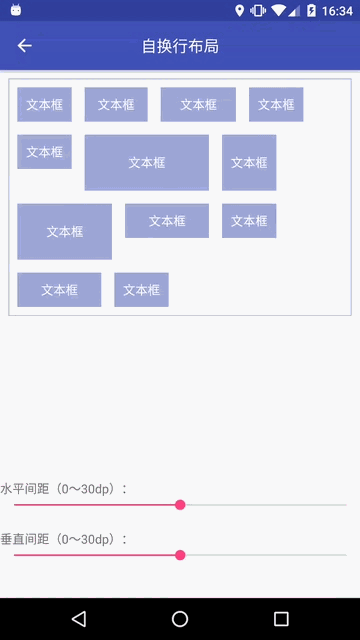

WrapLayout
==========


自动换行布局

介绍
---

自动换行布局，水平排列子项，并自动换行，支持不等长不等宽子项，且可以设置垂直间距与水平间距及子项对齐模式。

截图
---



先决条件
----

minSdkVersion 4

入门
---

**引用:**

```
dependencies {
    ...
    implementation 'am.widget:wraplayout:1.2.1'
    ...
}
```

**布局:**

```xml
<am.widget.wraplayout.WrapLayout
    xmlns:app="http://schemas.android.com/apk/res-auto"
    android:id="@+id/wly_lyt_warp"
    android:layout_width="match_parent"
    android:layout_height="wrap_content"
    android:layout_margin="10dp"
    android:background="@drawable/bg_wraplayout_content"
    android:horizontalSpacing="10dp"
    android:padding="10dp"
    android:verticalSpacing="10dp"
    app:wlyHorizontalSpacing="10dp"
    app:wlyVerticalSpacing="10dp"
    app:wlyGravity="top">
    <TextView
        android:layout_width="wrap_content"
        android:layout_height="wrap_content"
        app:wlyLayout_gravity="center" />
    ⋯
</am.widget.wraplayout.WrapLayout>
```

**代码：**

```
WrapLayout lytWrap = (WrapLayout) findViewById(R.id.wly_lyt_warp);
lytWrap.setHorizontalSpacing(20);
lytWrap.setVerticalSpacing(20);
lytWrap.setGravity(WrapLayout.GRAVITY_CENTER);
```

注意
---

- android:horizontalSpacing 与 app:wlyHorizontalSpacing只定义一份即可
- android:verticalSpacing 与 app:wlyVerticalSpacing只定义一份即可
- 通过getNumRows()方法获取行数目
- 通过getNumColumns(int)方法获取某一行的列数目
- 通过app:wlyGravity或setGravity(int)方法设置子项对齐模式，仅支持上中下，左右对齐是无意义的。若子项设置布局Gravity，则不受其影响。
- 子项通过设置app:wlyLayout_gravity或获取其WrapLayout.LayoutParams的setGravity(int)方法设置子项自己的布局Gravity。

支持
---

- Google+: https://plus.google.com/114728839435421501183
- Gmail: moferalex@gmail.com

如果发现错误，请在此处提出:
https://github.com/AlexMofer/ProjectX/issues

许可
---

Copyright (C) 2015 AlexMofer

Licensed to the Apache Software Foundation (ASF) under one or more contributor
license agreements.  See the NOTICE file distributed with this work for
additional information regarding copyright ownership.  The ASF licenses this
file to you under the Apache License, Version 2.0 (the "License"); you may not
use this file except in compliance with the License.  You may obtain a copy of
the License at

http://www.apache.org/licenses/LICENSE-2.0

Unless required by applicable law or agreed to in writing, software
distributed under the License is distributed on an "AS IS" BASIS, WITHOUT
WARRANTIES OR CONDITIONS OF ANY KIND, either express or implied.  See the
License for the specific language governing permissions and limitations under
the License.